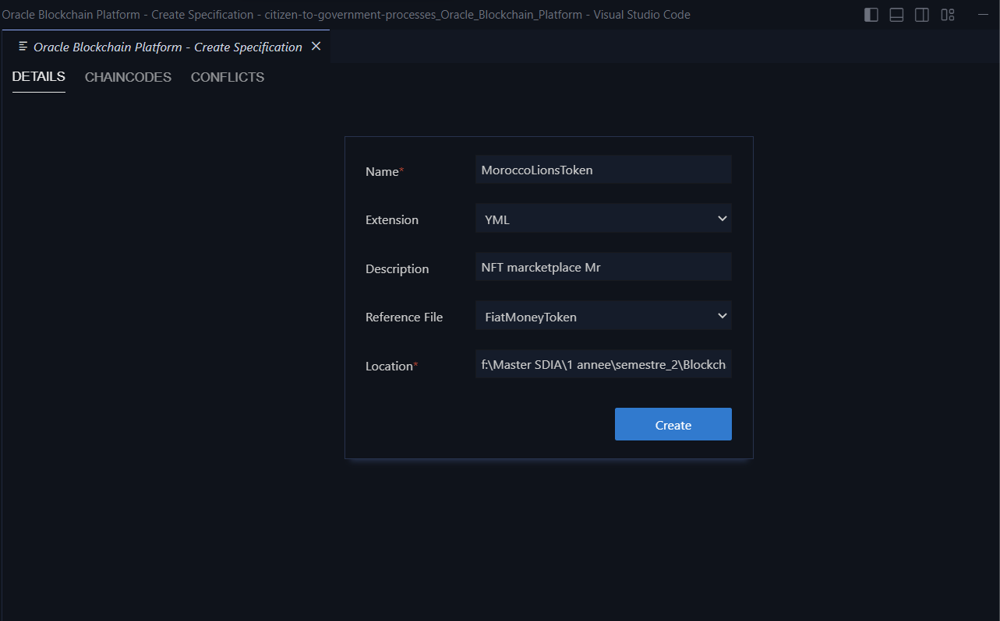

# Develop Hyperledger Fabric Applications With App Builder

- [Develop Hyperledger Fabric Applications With App Builder](#develop-hyperledger-fabric-applications-with-app-builder)
    - [Prerequisites](#prerequisites)
        - [Install AppBuilder CLI](#install-appbuilder-cli)
    - [App Builder Basics](#app-builder-basics)
    - [Test Chaincodes With Postman](#test-chaincodes-with-postman)

Oracle developed Oracle Blockchain App Builder as a toolset for rapid and manageable Hyperledger Fabric development that helps to develop, test, debug, and deploy smart contracts (chaincodes).

## Prerequisites
  - App Builder CLI

## Develop Blockchain NFTMarketplaceMr

### Create Specification File
We will now create the specification file ```MoroccoLionsToken.yaml```.



```yaml

 assets:
    - name: MoroccanArtCollections
      type: token
      symbol: ART      #mandatory
      standard: erc721+   
      anatomy:
        type: nonfungible
        unit: whole
      behavior:
        - indivisible      # mandatory
        - singleton        # mandatory
        - mintable:        # mandatory
            max_min_quantity: 20000
        - transferable
        - burnable
        - roles:
            minter_role_name: minter
      properties:
        - name: price
          type: number
        - name: on_sale_flag
          type: boolean
      metadata:
        - name: painting_name
          type: string
        - name: description
          type: string
        - name: image
          type: string
        - name: painter_name
          type: string
 ```
In this sample specification file you can see all the sections and attributes for a representation of an NFT token. Just as a first overview of the sections defined in the file:
- ***Assets***: Place where the different assets (standard entities, FTs, NFTs) are defined. Inside each of the assets we can distingish different sections which can vary depending on the kind of represented asset. For NFTs and FTs these are the different subsections:
    - ***Type/Symbol/Standard***: You must indicate in these properties that this token is based in the ERC-721 Standard, and give to it a unic symbol indentifier.
    - ***Anatomy***: In this section you specify it is a non-fungible token (NFT) and whether it would be subdivided into smaller fractions (nowadays "whole" is the only option for NFT tokens).
    - ***Behavior***: In this section is where must be defined if the token can be minted, and in such case, which is the maximum number of mintable tokens. Here you must also state it is an indivisible token, if is singleton for each class, transferable, and burnable which is similar to its deletion, but not disapearing, so it is still there but not usable at all. Also in this section you can restrict token behaviors to specific roles.
    - ***Metadata***: This section define a sort of prpoperties which must be set during token creation, and can not be changed in the future. So its value will remain inmutable for the whole life of the token (i.e.: manufacturer, .
    - ***Properties***: Standard attributes of the token which can vary during the life of the token.
- ***customMethods***: Place where a list of non estandard methods are defined. For those methods AppBuilder will only generate the signature of the method, without any implementation on them. The implementation of these methods are the only code the be implemented by the developer.

After you detect all the necessary business processes over the assets in the chaincode, you create a list of custom methods. We will implement those methods afterward when the scaffolded project is generated. Let's add all the required smart contracts in the ```customMethods``` block:

```yaml
 customMethods:
   - executeQuery
   - "createAccountByConsumers(org_id: string, user_id: string, token_type: string)" # Create accounts for consumers while signing up
   - "sell(token_id: string, selling_price: number)" # Post the token for selling in the marketplace
   - "buyWithTokens(from_org_id: string, from_user_id: string, to_org_id: string, to_user_id: string, nonfungible_token_id: string, fungible_token_id: string, amount_paid: number)"  # Buy the NFT after paying the using FT Tokens 
   - "buyWithDirectPayment(from_org_id: string, from_user_id: string, to_org_id: string, to_user_id: string, nonfungible_token_id: string, amount_paid: number)"  # Buy the NFT after paying the amount using payment gateway
```

| :information_source: Note          |
|:-----------------------------------|
| ```executeQuery``` method enables you to execute SQL-ish queries on top of the world state database! Count, group, filter assets and more. Detailed instructions can be found [here](https://docs.oracle.com/en/database/other-databases/blockchain-enterprise/21.1/user/supported-rich-query-syntax.html#GUID-7A7766A3-EA2C-4A3D-BE62-7B4EC747EE5B).|

